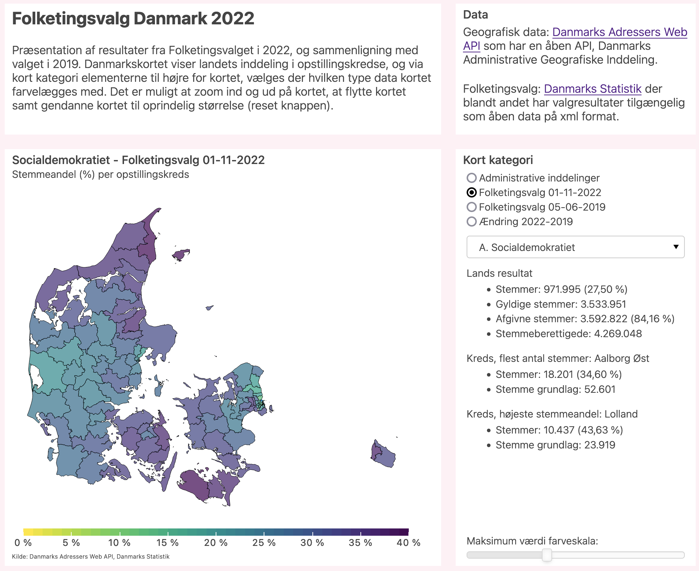

# Folketingsvalg Danmark 2022

An app to show the results of the lastest general election in Denmark on 1 November 2022.
Results presented as a choropleth map and different charts.
Mainly written in Python using the [Bokeh](https://docs.bokeh.org/en/latest/) library for the visualization part. Have used `topojson` to simplify the geometries of the district polygons and `geopandas` for among others to calculate the area of the districts in order to get a voters density. Have tested making a static html document with all the data in the document. Hence all widget callbacks are written in JavaScript. A static document with all the data makes the document big in size.

In order to run the app one needs to execute 
```
python main.py
```
And then open the [`index.html`](https://carve11.github.io/folketingsvalg/) document in a browser.


